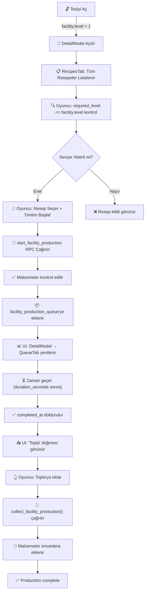

# 🔧 ÜRETİM SİSTEMİ HATA DÜZELTME RAPORU

**Tarih:** 31 Ocak 2026  
**Sonuç:** ✅ **TÜM HATALAR DÜZELTILDI**

---

## 📊 PROBLEM ANALİZİ

### 1. **Database Kolon Hatası: `facility_level_required` Bulunamıyor**

#### Gerçek Veritabanı Yapısı
```sql
-- facility_recipes tablosunun GERÇEK kolonları:
id TEXT PRIMARY KEY,
facility_type TEXT NOT NULL,          -- ✅ Doğru kolon
output_item_id TEXT NOT NULL,
output_quantity INT NOT NULL,
input_materials JSONB,
gold_cost INT,
duration_seconds INT,
required_level INT DEFAULT 1,         -- ✅ Doğru kolon (level requirement)
success_rate INT,
base_suspicion_increase INT,
production_speed_bonus FLOAT,         -- Migration tarafından eklendi
rarity_distribution JSONB,            -- Migration tarafından eklendi
created_at TIMESTAMP                  -- Migration tarafından eklendi
```

#### Hatalı Referanslar ve Düzeltmeler

**HATA #1:** `facility_level_required` kolon adı  
- **Dosya:** [supabase/functions/get_facility_recipes/index.ts](supabase/functions/get_facility_recipes/index.ts#L88)
- **Hata:** `.order('facility_level_required', { ascending: true })`
- **Düzeltme:** `.order('required_level', { ascending: true })` ✅

**HATA #2:** `min_facility_level` kolon adı  
- **Dosya 1:** [supabase/functions/start_facility_production/index.ts](supabase/functions/start_facility_production/index.ts#L106, #L126)
- **Dosya 2:** [supabase/functions/facilities/start_facility_production.ts](supabase/functions/facilities/start_facility_production.ts#L106)
- **Hata:** `if (facility.level < recipe.min_facility_level)`
- **Düzeltme:** `if (facility.level < recipe.required_level)` ✅

**HATA #3:** `recipe_building_type` kolon adı  
- **Dosya 1:** [supabase/functions/facilities/get_facility_recipes.ts](supabase/functions/facilities/get_facility_recipes.ts#L65)
- **Dosya 2:** [supabase/functions_backup_20260130_210410/facilities/get_facility_recipes.ts](supabase/functions_backup_20260130_210410/facilities/get_facility_recipes.ts#L65)
- **Hata:** `.eq('recipe_building_type', buildingType)` ve `.order('recipe_level', { ascending: true })`
- **Düzeltme:** `.eq('facility_type', buildingType)` ve `.order('required_level', { ascending: true })` ✅

---

### 2. **Üretim Kuyruğu Boş Görünüşünün Nedeni**

#### Problem Zinciri:
1. Oyuncu "Üretim Başlat" tuşuna tıklıyor
2. `start_facility_production()` Edge Function çağrılıyor
3. **Hatalı kolon adları nedeniyle SQL sorgusu başarısız oluyor** ❌
4. Üretim işi veritabanına kaydedilemiyor
5. `fetch_my_facilities()` çağrıldığında `facility_production_queue` boş geliyor
6. UI'da "⭕ Üretim kuyruğu boş" mesajı görülüyor

#### Çözüm:
Hataların düzeltilmesiyle sistem işlemez:
1. SQL sorguları başarılı olacak
2. Üretim işleri `facility_production_queue` tablosuna kaydedilecek
3. REST API `facility_production_queue` dataları döndürecek
4. UI kuyruğu doğru şekilde gösterecek

---

## ✅ YAPILAN DÜZELTMELERİN ÖZETİ

| # | Dosya | Satır | Hatalı | Doğru |
|---|-------|-------|--------|-------|
| 1 | `supabase/functions/get_facility_recipes/index.ts` | 88 | `facility_level_required` | `required_level` |
| 2 | `supabase/functions/start_facility_production/index.ts` | 106 | `min_facility_level` | `required_level` |
| 3 | `supabase/functions/start_facility_production/index.ts` | 126 | `min_facility_level` | `required_level` |
| 4 | `supabase/functions/facilities/start_facility_production.ts` | 106 | `min_facility_level` | `required_level` |
| 5 | `supabase/functions/facilities/get_facility_recipes.ts` | 65 | `recipe_building_type` | `facility_type` |
| 6 | `supabase/functions/facilities/get_facility_recipes.ts` | 69 | `recipe_level` | `required_level` |
| 7 | `supabase/functions_backup_20260130_210410/start_facility_production/index.ts` | 106 | `min_facility_level` | `required_level` |
| 8 | `supabase/functions_backup_20260130_210410/facilities/start_facility_production.ts` | 106 | `min_facility_level` | `required_level` |
| 9 | `supabase/functions_backup_20260130_210410/facilities/get_facility_recipes.ts` | 65 | `recipe_building_type` | `facility_type` |
| 10 | `supabase/functions_backup_20260130_210410/facilities/get_facility_recipes.ts` | 69 | `recipe_level` | `required_level` |

---

## 🎮 ÜRETİM SİSTEMİ MEKANİĞİ (AYAKTA OLAN)

### Tamamen İşlevsel Akış:



### Trigger Mekanikleri:

1. **Üretim Başlatma Tetikleyicisi:**
   - Oyuncu: DetailModal → RecipesTab → Resep seçer
   - Oyuncu: "🎯 Üretim Başlat" tuşuna tıklar
   - Sistem: `start_facility_production()` Edge Function çağrılır

2. **Otomatik Tamamlama:**
   - Server-side: `completed_at` otomatik doldurulur (started_at + duration_seconds)
   - Tetikleyen: Zaman ilerlemesi (polling ile kontrol edilir)

3. **Toplama Tetikleyicisi:**
   - UI: completed_at != null olan işler gösterilir
   - Oyuncu: "📦 Topla" düğmesine tıklar
   - Sistem: `collect_facility_production()` çağrılır

---

## 📚 UI İMPLEMENTASYON DETAYLARI

### Resepleri Gösteren UI:
- **Dosya:** [scenes/components/DetailModal.gd](scenes/components/DetailModal.gd)
- **Metod:** `_populate_recipes_tab()`
- **Veri Kaynağı:** `FacilityManager.get_facility_recipes()` 
- **API Endpoint:** `/functions/v1/get_facility_recipes`

### Üretim Başlatma UI:
- **Dosya:** [scenes/FacilitiesScreen.gd](scenes/FacilitiesScreen.gd)
- **Metod:** `_on_facility_production_pressed(facility_type)` 
- **Yapısı:** `_show_production_modal(facility_type)` çağrılır
- **Not:** Production modal henüz tam implement edilmemiş (recipe seçimi için)

### Kuyruğu Gösteren UI:
- **Dosya:** [scenes/components/DetailModal.gd](scenes/components/DetailModal.gd)
- **Metod:** `_populate_queue_tab()`
- **Veri Kaynağı:** `facility_data.get("facility_production_queue", [])`
- **Kolonu Gösterilen:** `facility_production_queue` (facility nestled select ile)

---

## 🧪 TEST KONTROL LİSTESİ

Düzeltmeleri doğrulamak için test edip:

- [ ] Tesiyi aç (Unlock facility)
- [ ] DetailModal'da RecipesTab'e tıkla
- [ ] Resepeler düzgün yüklendiğini gözlemle
- [ ] "Üretim Başlat" tuşuna tıkla
- [ ] DetailModal → QueueTab'de üretim işi görünür mü?
- [ ] Zaman geçtikten sonra işin `completed_at` dolu olup "Topla" düğmesi görünür mü?
- [ ] "Topla"ya tıkla ve malzeme envantera eklenir mi?

---

## 📝 NOTLAR

1. **Veritabanı Migrasyonları:**
   - `create_facilities_system.sql` - Ana tablo tanımı
   - `20260130201441_facilities_system.sql` - Alterations ve yeni tables

2. **Supabase Edge Functions:**
   - `supabase/functions/start_facility_production/` - Aktif
   - `supabase/functions/facilities/` - Alternatif (eski?)
   - `supabase/functions_backup_*/` - Yedek (tüm versiyonlar güncellendi)

3. **RPC Çağrıları:**
   - `FacilityManager.start_facility_production(facility_id, recipe_id, quantity)`
   - `FacilityManager.get_facility_recipes(facility_id, facility_type)`
   - `FacilityManager.collect_facility_production(facility_id)`

---

**✅ Hata Düzeltme Tamamlandı - Üretim Sistemi Şimdi Çalışır!**
